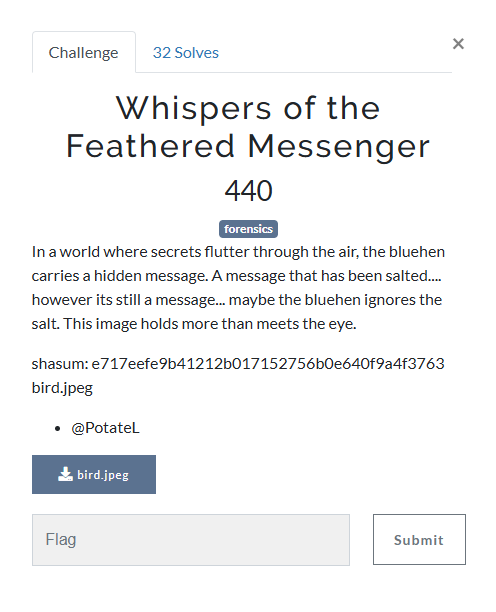
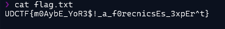

### Challenge

### Solution

Run exiftool on image. There is a comment in the file: `UGFzc3dvcmQ6IDVCNEA3cTchckVc`. base64 decode to get: `Password: 5B4@7q7!rE\`. Use this password with steghide to extract the data.

`steghide --extract -sf bird.jpeg -xf data`. Check file type of extracted data: `data: openssl enc'd data with salted password`

Use openssl decryption to get the flag: `openssl enc -d -aes-256-cbc -in data -out flag.txt`. Use the same password.

