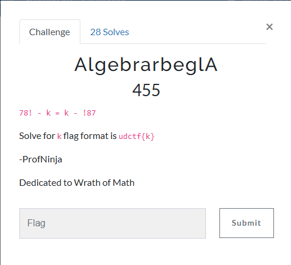

### Challenge

### Solution

Rearrage: `k = (78! + !87)/2`

Calculate [factorial](https://www.calculatorsoup.com/calculators/discretemathematics/factorials.php). `78! = 11324281178206297831457521158732046228731749579488251990048962825668835325234200766245086213177344000000000000000000`

Calculate [derangement](https://www.123calculus.com/en/derangement-page-1-16-240.html). ` !87 = 775400577052889667046640780055684375763111543171042155757864819229947211564419831641783864807987394389543160788597793657791613938734`

Use [Precision Calculator](https://www.mathsisfun.com/calculator-precision.html) to calculate values: `(78! + !87) / 2`.

Wrap the answer in flag: `udctf{1163100865579334506232101759186675479373427894122586348002672018589046812371111160297093459829081474706857847771568690486687420908101}`