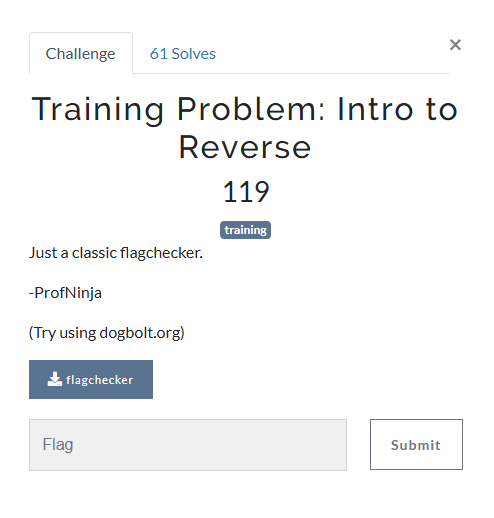

### Challenge




### Solution

Decompiling using dogbolt shows a string: `ucaqbvl,n*d\\\'R#!!l`. This is our flag but every next letter is shifted by -n ascii value. So for starting, `u` is shifted by 0. Then `c` is shifted by -1, `a` is shifted by -2 and so on. Reverse this process to get the flag.

Here the python script

```python
string = "ucaqbvl,n*d\\\'R#!!l"
inc = 0
res = []

for l in string:
    asc = ord(l)
    asc += inc

    normal = chr(asc)

    res += [normal]
    inc += 1

s = ''.join(res)
print(s)
```

Run this to get the flag: `udctf{r3v3ng3_101}`