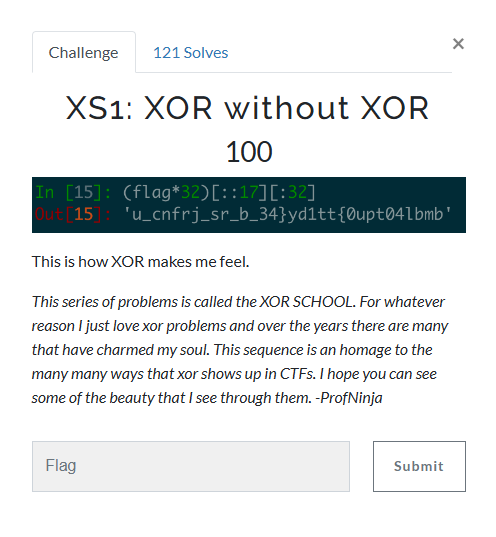

### Challenge




### Solution

Reverse the process to get the flag.

```python
flag = "u_cnfrj_sr_b_34}yd1tt{0upt04lbmb"

list1 = []

for i in range(0,32,2):
    list1.append(flag[i])
    list1.append(flag[(i+17)%32])

res = ''.join(list1)

print(res)
```

Flag: `udctf{just_4_b4by_1ntr0_pr0bl3m}`