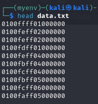

### Challenge


### Solution

We got pcap file that contains `USB Leftover Data`. It seems like key strokes. We only need data from packets with 71 lengths, as these are packets that contains key presses.


Using tshark:

`tshark -r klogger.pcapng -Y "(frame.len == 71)" -e "usb.capdata" -T fields > data.txt `





Now we need to decode these values, I found a great script [here](https://blog.stayontarget.org/2019/03/decoding-mixed-case-usb-keystrokes-from.html):

```python

#!/usr/bin/python
# coding: utf-8
from __future__ import print_function
import sys,os

#declare -A lcasekey
lcasekey = {}
#declare -A ucasekey
ucasekey = {}

#associate USB HID scan codes with keys
#ex: key 4  can be both "a" and "A", depending on if SHIFT is held down
lcasekey[4]="a";           ucasekey[4]="A"
lcasekey[5]="b";           ucasekey[5]="B"
lcasekey[6]="c";           ucasekey[6]="C"
lcasekey[7]="d";           ucasekey[7]="D"
lcasekey[8]="e";           ucasekey[8]="E"
lcasekey[9]="f";           ucasekey[9]="F"
lcasekey[10]="g";          ucasekey[10]="G"
lcasekey[11]="h";          ucasekey[11]="H"
lcasekey[12]="i";          ucasekey[12]="I"
lcasekey[13]="j";          ucasekey[13]="J"
lcasekey[14]="k";          ucasekey[14]="K"
lcasekey[15]="l";          ucasekey[15]="L"
lcasekey[16]="m";          ucasekey[16]="M"
lcasekey[17]="n";          ucasekey[17]="N"
lcasekey[18]="o";          ucasekey[18]="O"
lcasekey[19]="p";          ucasekey[19]="P"
lcasekey[20]="q";          ucasekey[20]="Q"
lcasekey[21]="r";          ucasekey[21]="R"
lcasekey[22]="s";          ucasekey[22]="S"
lcasekey[23]="t";          ucasekey[23]="T"
lcasekey[24]="u";          ucasekey[24]="U"
lcasekey[25]="v";          ucasekey[25]="V"
lcasekey[26]="w";          ucasekey[26]="W"
lcasekey[27]="x";          ucasekey[27]="X"
lcasekey[28]="y";          ucasekey[28]="Y"
lcasekey[29]="z";          ucasekey[29]="Z"
lcasekey[30]="1";          ucasekey[30]="!"
lcasekey[31]="2";          ucasekey[31]="@"
lcasekey[32]="3";          ucasekey[32]="#"
lcasekey[33]="4";          ucasekey[33]="$"
lcasekey[34]="5";          ucasekey[34]="%"
lcasekey[35]="6";          ucasekey[35]="^"
lcasekey[36]="7";          ucasekey[36]="&"
lcasekey[37]="8";          ucasekey[37]="*"
lcasekey[38]="9";          ucasekey[38]="("
lcasekey[39]="0";          ucasekey[39]=")"
lcasekey[40]="Enter";      ucasekey[40]="Enter"
lcasekey[41]="esc";        ucasekey[41]="esc"
lcasekey[42]="";           ucasekey[42]=""
lcasekey[43]="tab";        ucasekey[43]="tab"
lcasekey[44]="";          ucasekey[44]=""
lcasekey[45]="-";          ucasekey[45]="_"
lcasekey[46]="=";          ucasekey[46]="+"
lcasekey[47]="[";          ucasekey[47]="{"
lcasekey[48]="]";          ucasekey[48]="}"
lcasekey[49]="\\";         ucasekey[49]="|"
lcasekey[50]=" ";          ucasekey[50]=" "
lcasekey[51]=";";          ucasekey[51]=":"
lcasekey[52]="'";          ucasekey[52]="\""
lcasekey[53]="`";          ucasekey[53]="~"
lcasekey[54]=",";          ucasekey[54]="<"
lcasekey[55]=".";          ucasekey[55]=">"
lcasekey[56]="/";          ucasekey[56]="?"
lcasekey[57]="CapsLock";   ucasekey[57]="CapsLock"
lcasekey[79]="RightArrow"; ucasekey[79]="RightArrow"
lcasekey[80]="LeftArrow";  ucasekey[80]="LeftArrow"
lcasekey[84]="/";          ucasekey[84]="/"
lcasekey[85]="*";          ucasekey[85]="*"
lcasekey[86]="-";          ucasekey[86]="-"
lcasekey[87]="+";          ucasekey[87]="+"
lcasekey[88]="Enter";      ucasekey[88]="Enter"
lcasekey[89]="1";          ucasekey[89]="1"
lcasekey[90]="2";          ucasekey[90]="2"
lcasekey[91]="3";          ucasekey[91]="3"
lcasekey[92]="4";          ucasekey[92]="4"
lcasekey[93]="5";          ucasekey[93]="5"
lcasekey[94]="6";          ucasekey[94]="6"
lcasekey[95]="7";          ucasekey[95]="7"
lcasekey[96]="8";          ucasekey[96]="8"
lcasekey[97]="9";          ucasekey[97]="9"
lcasekey[98]="0";          ucasekey[98]="0"
lcasekey[99]=".";          ucasekey[99]="."

#make sure filename to open has been provided
if len(sys.argv) == 2:
        keycodes = open(sys.argv[1])
        for line in keycodes:
                #dump line to bytearray
                bytesArray = bytearray.fromhex(line.strip())
                #see if we have a key code
                val = int(bytesArray[2])
                if val > 3 and val < 100:
                        #see if left shift or right shift was held down
                        if bytesArray[0] == 0x02 or bytesArray[0] == 0x20 :
                                print(ucasekey[int(bytesArray[2])], end=''),  #single line output
                                #print(ucasekey[int(bytesArray[2])])            #newline output
                        else:
                                print(lcasekey[int(bytesArray[2])], end=''),  #single line output
                                #print(lcasekey[int(bytesArray[2])])            #newline output
else:
    print("USAGE: python %s [filename]" % os.path.basename(__file__))

```

There were a lot of `space` and `del` buttons pressed which will result in a messy output when decoding. I simply altered the script to not decode these two values.


There is still some gibberish and repeating values, but we can filter them manually to get the flag:

`irisctf{this_keylogger_is_too_hard_to_use}`