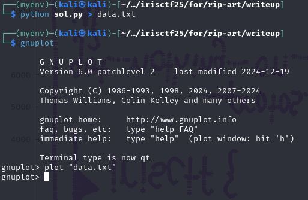

### Challenge


### Solution

We have a pcap file which contains USB data. It seems like mouse data and the challenge details also suggests that some drawing was made. We can use this tool to visualize the mouse data: [USB Mouse Pcap Visualizer](https://usb-mouse-pcap-visualizer.vercel.app/)


We got this data. It seems like half the flag. For other half we have to decode data manually.


Analyzing `Leftover Capture Data` in wireshark, we can see that all packets with length 74 seems to contains mouse data.


We can then use `tshark` to grab Leftover Data for only these packets:

`tshark -r art.pcapng -Y "(frame.len == 74)" -e "usb.capdata" -T fields > mouse_data.txt`


Using `sed 's/../&:/g; s/:$//' mosue_data.txt > formatted.txt` we can properly format the data in seperate bytes. Now we have data that looks something like this:


Convert the 3-7 bytes into coordinates using `awk`:

`awk -F: '{x=$3$4;y=$5$6}{z=$7}$1=="02"{print x,y,z}' formatted.txt > hex.txt`


Now we need to format coordinates, I used the script from [here](https://ctftime.org/writeup/16410):

```python
from pwn import *
for i in open('hex.txt').readlines():
    ii = i.strip().split(' ')
    x = int(ii[0], 16)
    y = int(ii[1], 16)
    z = int(ii[2], 16)
    if z > 0:
        print(u16(struct.pack(">H", x)), u16(struct.pack(">H", y)))

```


Plot the data on a graph using `gnuplot`:




We got other half of the flag:


Use any online tool to mirror the image.

The final flag: `irisctf{usb_comm_protos_got_nothing_on_u}`
