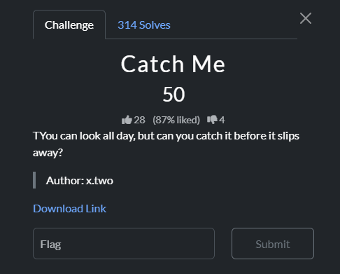

### Challenge




### Solution


The provided gif contains 349 frames that are qr codes. Every qr code contains a base64 encoded string, one of which is the flag. To get the flag, split the gif frames using any online tool (like this: https://ezgif.com/). Then decode the qr codes using a script. Here's a sample script:
(This can also be done manually 💀)


```
import os, cv2

detector = cv2.QRCodeDetector()
results = []

for f in os.listdir("qrcodes"):
    if f.endswith(".png"):
        img = cv2.imread(os.path.join("qrcodes", f))
        data, _, _ = detector.detectAndDecode(img)
        if data:
            results.append(data)

with open("base64data.txt", "w") as out:
    out.write("\n".join(results))
```

Then flag can be obtained by simply decoding this base64 data:

base64 -d base64data.txt | grep QnQSec

`QnQSec{C4TCH_M3_1F_Y0U_C4N}`