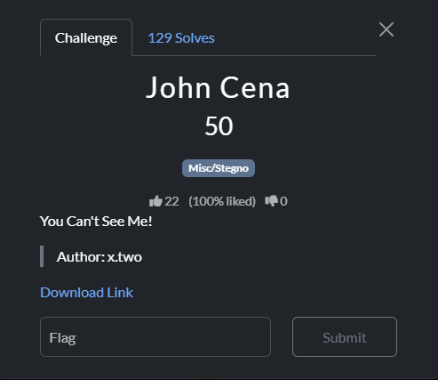
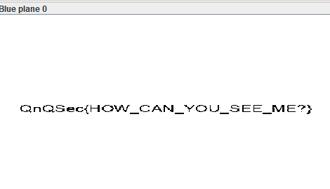

### Challenge

### Solution

The provided gif contains about 40 frames. The last frame is a blank white image that has a flag hidden in its blue channel. To get the flag, split the gif using an online tool or with ffmpeg:

`ffmpeg -i john-cena.gif frame_%03d.png`

(Note: only splitting to png works, as other formats will ruin the image channels which will destroy the flag)

After splitting the gif frames, one frame stands out of all as it is blank white. View the blue channel of this frame using stegsolve or similar tool. You will get the flag. 

`QnQSec{HOW_CAN_YOU_SEE_ME?}`