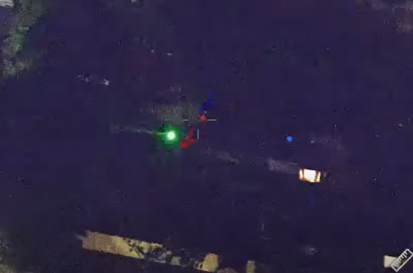

### Challenge

### Solution

We are provided with this image:

The image is taken from a video uploaded on social media by Manatee County Sheriff's Office.

Facebook post link: https://www.facebook.com/watch/?v=1399669658542445
Instagram post link: https://www.instagram.com/p/DO6kmzUiUUa/

The original video has exact location mentioned on it (929 16th Street W) which is redacted for challenge. Find the original video using the provided image and clues in the description. Then find the Latitude and Longitude of that location from Google Maps to get the flag.

The shortest solution is to upload the image to google lens along with this search query: `police helicopter struck by a laser`. The match would be in top few results.

Find the coordinates and format to the proper syntax. Final flag:

`QnQSec{27.4908N,82.5770W}`