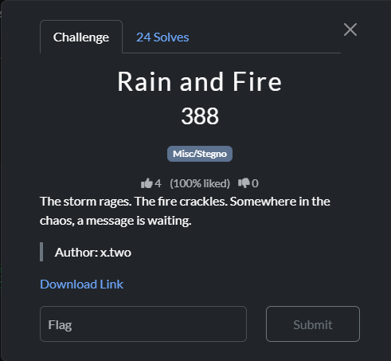
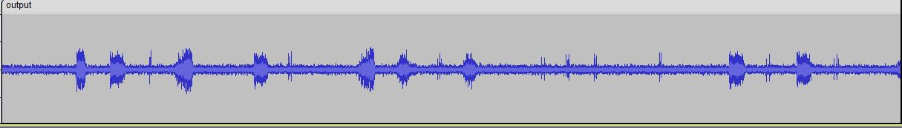

### Challenge




### Solution


We are provided with two audio files: `rain.wav` and `fire.wav`. These files combined contain the flag encoded in morse code. To view the morse code, both audios need to be combined in such a way that they overlay each other. The simplest way to combine audios is by using the following command:


`ffmpeg -i rain.wav -i fire.wav -filter_complex amix=inputs=2:duration=longest output.wav`

(This can also be done by opening both files simultaneously in audacity, and then exporting them as a single file)


Now open the combined audio in a spectrogram viewer (audacity or sonic visualizer). You will see a spectrogram which is a simple morse code.



This was the morse code:

```
--.- -. --.- ... . -.-. -.--. .-. ....- .---- -. ..--.- ....- -. -.. ..--.- ..-. .---- .-. ...-- ..--.- -.-. ....- -. ..--.- -... ...-- ..--.- -- ...-- .-. --. ...-- -.. -.--.-
```

Which translates to:

`QnQSec{R41N_4ND_F1R3_C4N_B3_M3RG3D}`
