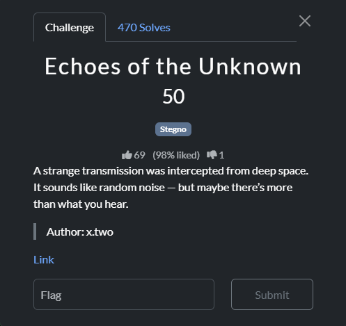
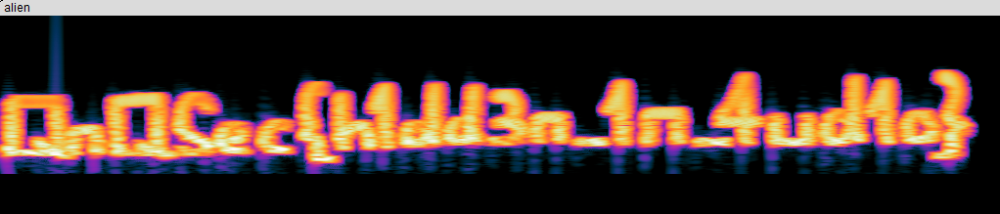

### Challenge

### Solution

This was a simple audio steganography challenge where the flag is hidden in spectrogram layer. Open the file in Audacity, change the view to spetrogram to reveal the flag.

`QnQSec{h1dd3n_1n_4ud1o}`