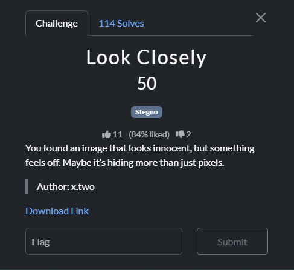

### Challenge

### Solution

This is the provided image:

It's a simple steghide challenge where extracting image with steghide reveals a `flag.txt` file. The passphrase to extract the flag is written on the image as text.

`steghide --extract -sf chal.jpg -p QNQS3C`

`QnQSec{stegno_1s_fun}`
