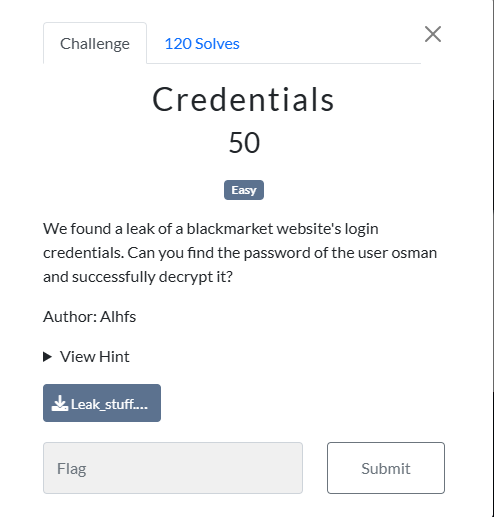
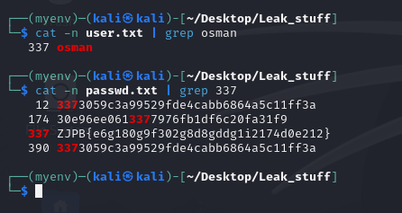
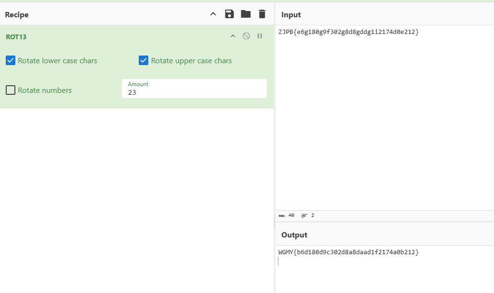

### Challenge

### Solution

We have two files, `user.txt` and `passwd.txt`. We have to find the passwd for user `osman`. All users have their respective password in the password file. So we can simply see the line number at which the user osman is located in the user file, and then grab respective password from passwd file. 

The 337 entry contains our value which is altered using shift cipher. Shifting values by 23, we get the flag:

