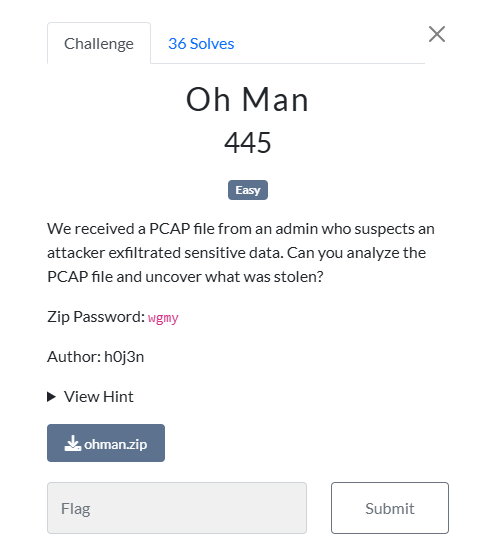
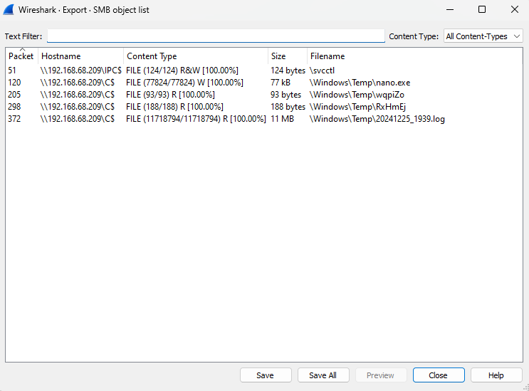
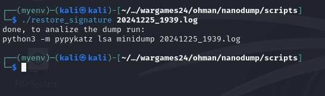
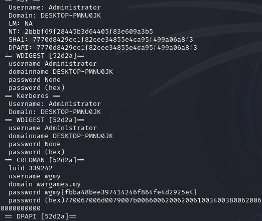

### Challenge




### Solution


We got a pcap file which contains smb encrypted data. I found this great resource on how to decrypt this data:

[Crack ntlm](https://www.youtube.com/watch?v=lhhlgoMjM7o)


Following this, we cracked the ntlm password by which we can decrypt the SMB encrypted data. By decrypting, we found some files that were transfered:




One file contains the following data:

```
The minidump has an invalid signature, restore it running:
scripts/restore_signature 20241225_1939.log
Done, to get the secretz run:
python3 -m pypykatz lsa minidump 20241225_1939.log
```

This showed that the log file we retrieved is acutally a minidump file which has been altered. By using `restore_signature` script from [nanodump](https://github.com/fortra/nanodump), we can recover the minidump file.




And then we can use pypykatz to view the data, which gave us our flag:

