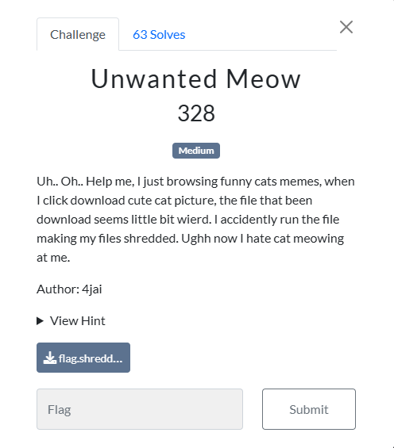
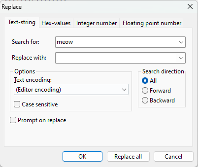
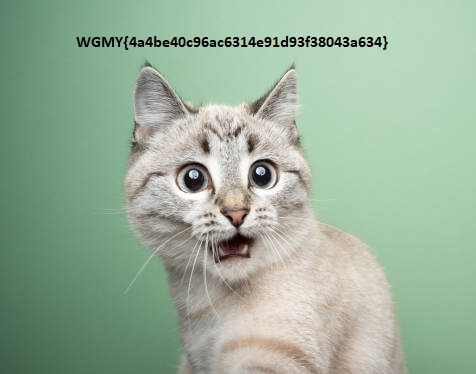

### Challenge

### Solution

We were given an image file which seems to be broken. By analyzing I found the original source of the image. Comparing the image with original one showed that there are a lot of `meow` words added between image data. We can get the flag by removing them. I used HxD hex editor which did the job.

This fixed our image and we got the flag.

