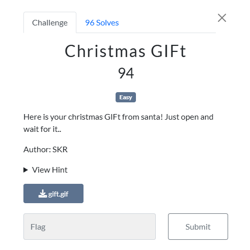
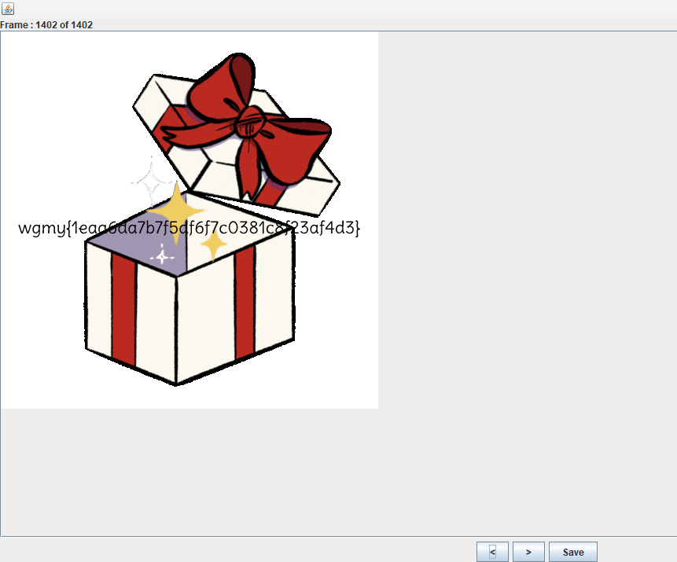

### Challenge

### Solution

We were given the following GIF image:

We can get the flag when the gift box opens at the end of gif. But the gif is very long and has 1402 frames. We can simply break down its frames and jump to the last one to get the flag. I used stegsolve to do this.

