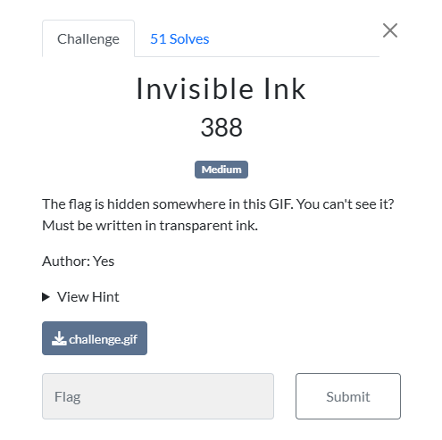

### Challenge

### Solution

We were given the following gif image:

It seems like it is printing flag after time ends but we can't see it due to the flag being invisible. Analyzing the gif frames in stegsolve showed two frames which seems like containing flag but it is still not readable.

Now we can save both of these frames as a seperate image and simply by changing few planes in stegsolve we can see the data in images much clearly. But it is still not readable.

It seems like that this is half the flag and we need to combine the second image with this one to get the complete flag. Again, we can use stegsolve's image combiner functionality to do this. 

